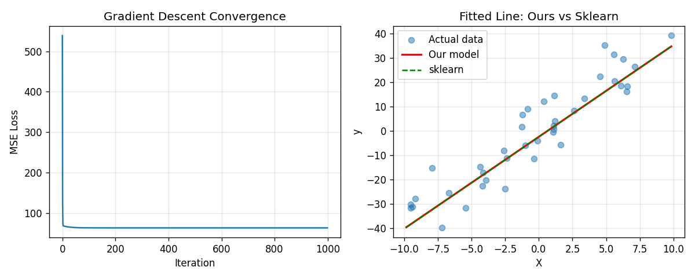
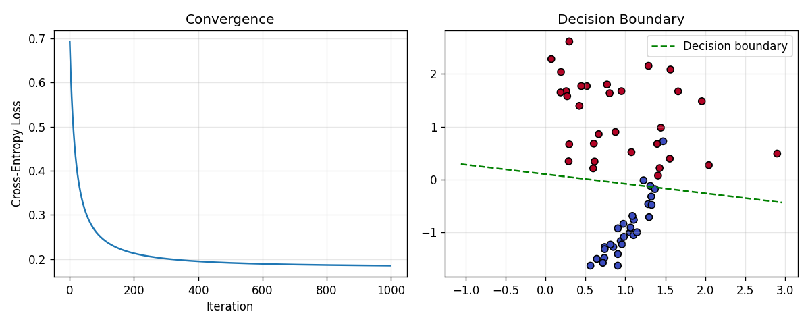
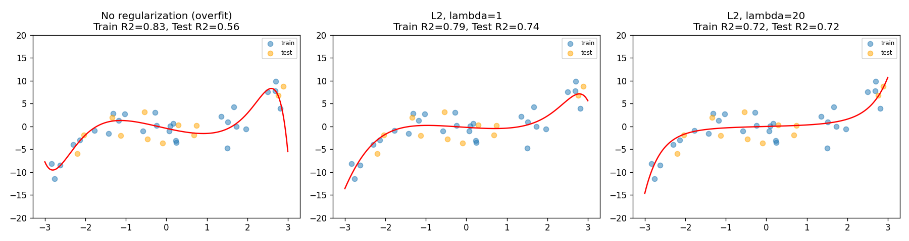
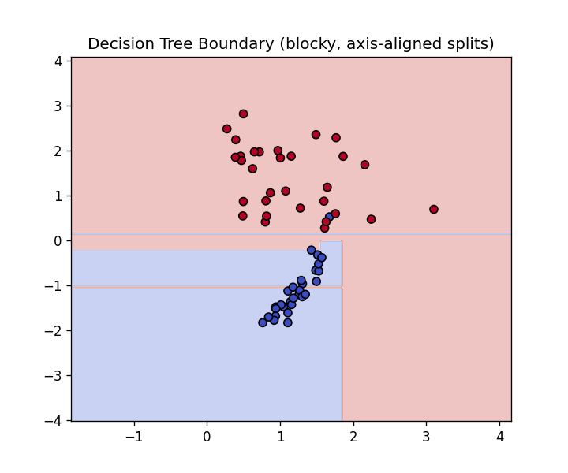
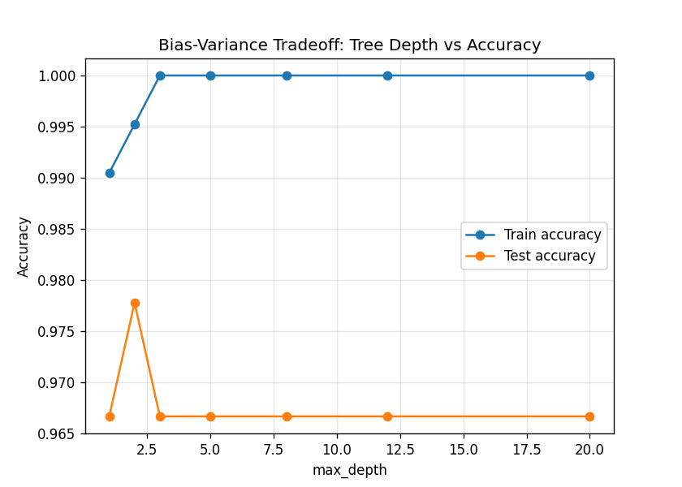

# MLCore: Machine Learning Algorithms Built From First Principles

Most ML portfolios call `sklearn.LinearRegression()` and stop there.
This project implements core ML algorithms **from scratch using only
NumPy**, then benchmarks each one against sklearn's production
implementation to prove mathematical correctness.

Goal: build a genuinely solid foundation in the math and mechanics
that power machine learning and, eventually, deep learning.

## Why this project

Understanding *how* a model learns (loss function -> gradient ->
parameter update) is the single idea that underlies linear
regression, logistic regression, neural networks, and even the
training of large language models. This repo builds that
understanding one algorithm at a time, with each one verified against
a trusted library.

## Progress

| Day | Algorithm | Status |
|---|---|---|
| 1 | Linear Regression (Gradient Descent) | ✅ Done |
| 2 | Logistic Regression — Sigmoid & Cross-Entropy Loss | ✅ Done |
| 3 | Regularization — L1 / L2, Bias-Variance Tradeoff | ✅ Done |
| 4 | Decision Trees — Entropy & Information Gain | ✅ Done|
| 5 | Applied project: Credit Risk Prediction | 🔜 |
| 6 | Neural Network from scratch (backprop) | 🔜 |
| 7 | Model explainability + final write-up | 🔜 |

## Structure

```
mlcore/
├── day1_linear_regression/
│   ├── linear_regression.py       # from-scratch implementation
│   ├── train_and_compare.py       # benchmarks vs sklearn
│   └── test_linear_regression.py  # unit tests
├── plots/                          # saved result visualizations
├── PROGRESS.md                     # daily log (also used to resume work)
└── requirements.txt
```

## Day 1: Linear Regression

Implemented gradient descent from scratch and verified it converges
to the exact same weights as sklearn's `LinearRegression`:

```
OUR scratch model learned: w=3.773, b=-2.401
SKLEARN learned:          w=3.773, b=-2.401
```

Also ran a learning-rate experiment showing gradient explosion when
the learning rate is too high — see `PROGRESS.md` for details.




## Day 2 — Logistic Regression

Extended Day 1's linear model into a binary classifier by adding a
sigmoid activation and switching to binary cross-entropy loss.
Benchmarked against sklearn's `LogisticRegression` on synthetic,
linearly separable data.

**Result:**


The small gap vs. sklearn is expected — sklearn applies L2
regularization by default, which our implementation doesn't yet.
Day 3 adds this and closes the gap.

**Convergence and decision boundary:**




## Day 3 — Regularization (L1/L2)

As regularization strength increases, the train/test gap shrinks —
the model gives up some training fit in exchange for generalizing
better to unseen data. This is the bias-variance tradeoff made visible.

**Overfitting vs. regularized fits:**



## Day 4 — Decision Trees

Implemented a decision tree from scratch using entropy and
information gain for recursive greedy splitting — a fundamentally
different optimization approach than the gradient-based models in
Days 1-3.


**Decision boundary** — note the blocky, axis-aligned regions,
very different from logistic regression's straight diagonal line:



**Bias-variance tradeoff via tree depth** — train accuracy climbs
toward 100% as depth increases, while test accuracy peaks then
plateaus or drops, the same overfitting pattern seen in Day 3 with
regularization, but through a different mechanism (depth vs. lambda):



### Run it locally
```bash
cd day4_decision_trees
python train_and_compare.py
python depth_experiment.py
python -m pytest test_decision_tree.py -v
```